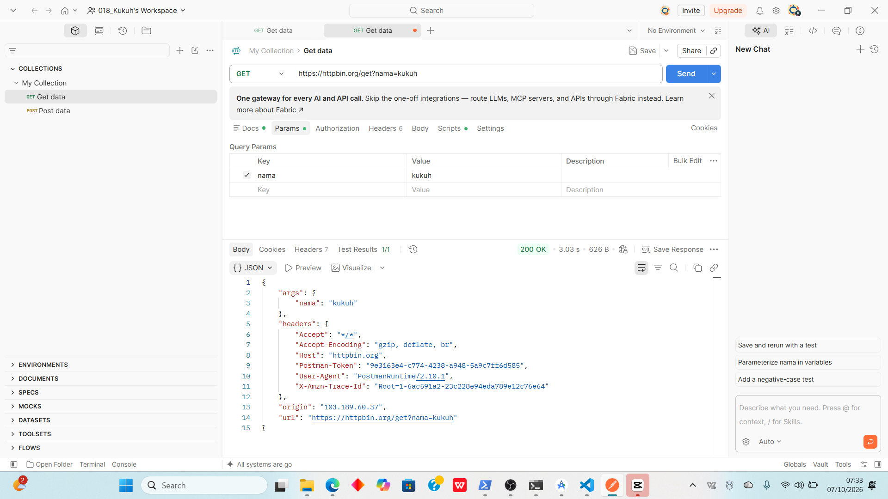
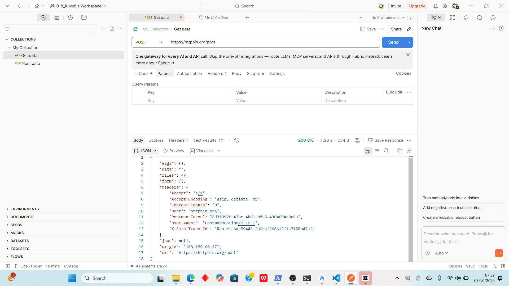
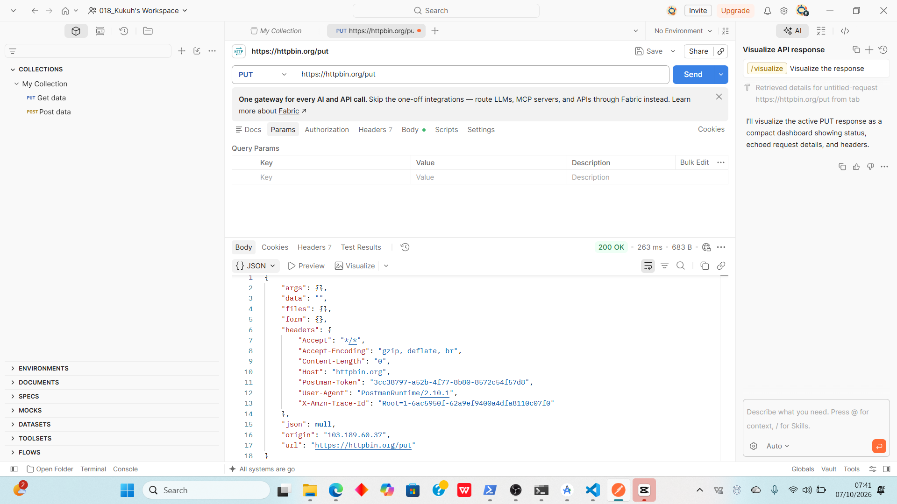
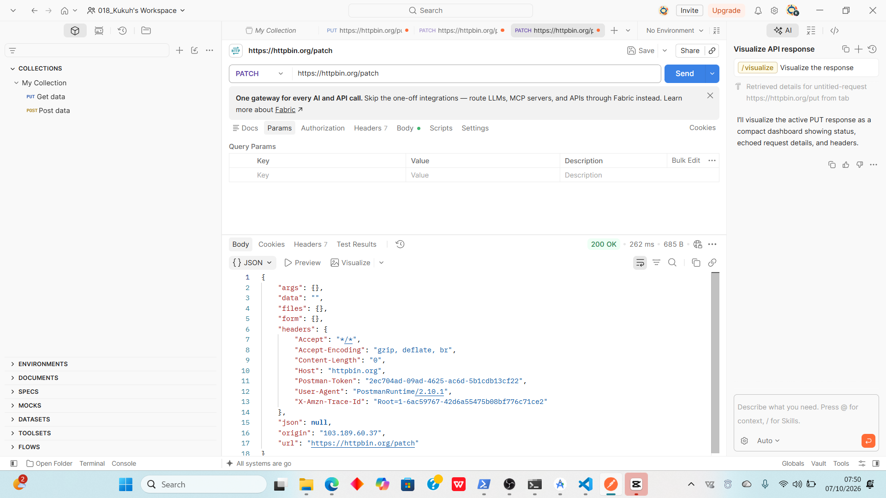
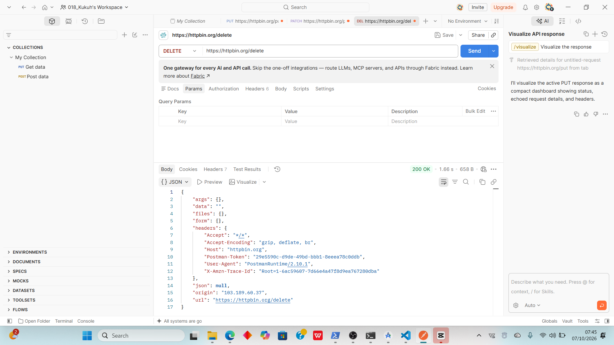

# Tugas Mandiri 1 — Mengenal HTTP Method dan Endpoint

## Hasil Pengujian HTTP Method di HTTPBin

| No | Method | Endpoint | Data yang dikirim | Status | Hasil |
|---:|:---|:---|:---|---:|:---|
| 1 | GET | `/get` | Query parameter `?nama=kukuh` | 200 | Mengembalikan data query parameter, header, dan informasi request. |
| 2 | POST | `/post` | JSON/body `{"pesan":"halo praktikum"}` | 200 | Mengembalikan data JSON yang dikirim melalui body request. |
| 3 | PUT | `/put` | JSON/body `{"status":"aktif"}` | 200 | Mengembalikan data yang dikirim melalui request PUT. |
| 4 | PATCH | `/patch` | JSON/body `{"status":"nonaktif"}` | 200 | Mengembalikan data yang dikirim melalui request PATCH. |
| 5 | DELETE | `/delete` | - | 200 | Mengembalikan informasi bahwa request DELETE telah diterima. |

---

## Detail Pengujian

### 1. GET

- **URL:** `https://httpbin.org/get?nama=kukuh`
- **Tujuan:** Mengambil data dari server.
- **Data:** Query parameter `nama=kukuh`
- **Status:** `200 OK`
- **Response Body:** JSON yang berisi `args`, `headers`, dan `origin`.
- **Informasi yang dikembalikan:** Server mengembalikan parameter `nama=kukuh` dan informasi request.

### 2. POST

- **URL:** `https://httpbin.org/post`
- **Tujuan:** Mengirim data ke server.
- **Data:** `{"pesan":"halo praktikum"}`
- **Status:** `200 OK`
- **Response Body:** JSON yang berisi data JSON yang dikirim.
- **Informasi yang dikembalikan:** Server mengembalikan data yang dikirim melalui body request.

### 3. PUT

- **URL:** `https://httpbin.org/put`
- **Tujuan:** Menguji pembaruan data menggunakan method PUT.
- **Data:** `{"status":"aktif"}`
- **Status:** `200 OK`
- **Response Body:** JSON yang berisi data request.
- **Informasi yang dikembalikan:** Server mengembalikan data yang dikirim melalui request PUT.

### 4. PATCH

- **URL:** `https://httpbin.org/patch`
- **Tujuan:** Menguji pembaruan sebagian data menggunakan method PATCH.
- **Data:** `{"status":"nonaktif"}`
- **Status:** `200 OK`
- **Response Body:** JSON yang berisi data request.
- **Informasi yang dikembalikan:** Server mengembalikan data yang dikirim melalui request PATCH.

### 5. DELETE

- **URL:** `https://httpbin.org/delete`
- **Tujuan:** Menguji request untuk menghapus data.
- **Data:** Tidak ada.
- **Status:** `200 OK`
- **Response Body:** JSON yang berisi informasi request.
- **Informasi yang dikembalikan:** Server mengonfirmasi bahwa request DELETE telah diterima.

---

## Screenshot

### 1. Screenshot GET Request

### 2. Screenshot POST Request

### 3. Screenshot PUT Request

### 4. Screenshot PATCH Request

### 5. Screenshot DELETE Request
