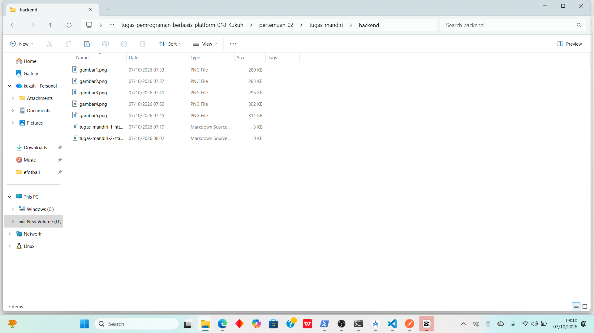
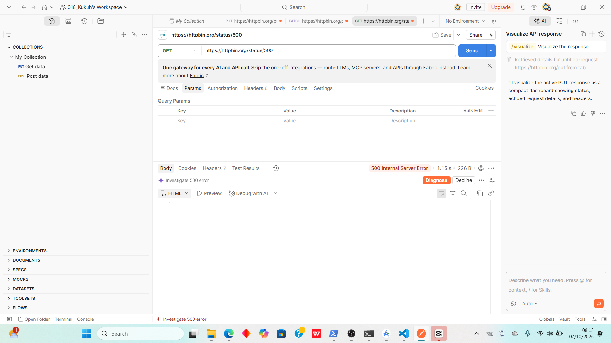

# Tugas Mandiri 2 — Memahami HTTP Status Code

## Tabel Hasil Pengujian HTTP Status Code

| Status Code | Arti | Hasil Pengujian | Kapan Digunakan |
|---:|:---|:---|:---|
| 200 | OK | Request berhasil diproses dan server mengembalikan data yang diminta. | Digunakan pada operasi GET/POST/PUT/PATCH yang sukses. |
| 201 | Created | Request berhasil dan sumber daya (resource) baru telah sukses dibuat di server. | Digunakan setelah operasi POST yang berhasil membuat data baru (misal: registrasi user). |
| 400 | Bad Request | Server tidak dapat memproses request karena kesalahan sintaks atau format data dari klien. | Digunakan ketika parameter/body request tidak valid atau kurang lengkap. |
| 401 | Unauthorized | Request memerlukan autentikasi pengguna, tetapi token/kredensial tidak ada atau tidak valid. | Digunakan saat mencoba mengakses endpoint privat tanpa login atau token expired. |
| 403 | Forbidden | Server memahami request tetapi menolak untuk mengotorisasinya (hak akses tidak cukup). | Digunakan ketika user sudah login tetapi tidak memiliki hak akses ke halaman/data tertentu. |
| 404 | Not Found | Server tidak dapat menemukan sumber daya atau endpoint yang diminta. | Digunakan ketika URL endpoint salah atau data di database tidak ditemukan. |
| 500 | Internal Server Error | Terjadi kesalahan yang tidak terduga pada sisi server saat memproses request. | Digunakan ketika ada error pada kode backend, koneksi database terputus, atau server crash. |

---

## Pertanyaan Analisis

### 1. Apa perbedaan 400 dan 404?
- **400 (Bad Request):** Menandakan bahwa server mendeteksi adanya kesalahan dari sisi klien (seperti format JSON salah atau parameter kurang), sehingga server menolak memprosesnya.
- **404 (Not Found):** Menandakan bahwa rute atau alamat endpoint yang diminta oleh klien tidak ditemukan sama sekali di server.

### 2. Apa perbedaan 401 dan 403?
- **401 (Unauthorized):** Klien belum dikenali karena belum melakukan login atau identitas autentikasinya (seperti token API) tidak valid.
- **403 (Forbidden):** Identitas klien sudah dikenali (sudah login), tetapi klien tersebut tidak memiliki izin akses (*permissions*) untuk membuka resource tersebut.

### 3. Mengapa 500 menunjukkan masalah pada sisi server?
Karena kode status 500 mengindikasikan bahwa server mengalami kendala internal yang tidak terduga (seperti *bug* pada script backend, kegagalan query database, atau kehabisan memori) sehingga gagal merespon request, bukan karena kesalahan input dari pengguna.

### 4. Apakah semua error HTTP berarti server mengalami kerusakan?
Tidak. Error HTTP dibagi menjadi dua kategori utama:
- **Client Error (Kelompok 4xx):** Menandakan kesalahan ada di pihak pengirim/klien (misalnya salah mengetik URL atau salah mengirim format data).
- **Server Error (Kelompok 5xx):** Baru menandakan adanya masalah atau kerusakan di sisi server.

---

## Screenshot Pengujian Status Code

### 1. Screenshot Status 200 OK

### 2. Screenshot Status 404 Not Found

### 3. Screenshot Status 500 Internal Server Error
