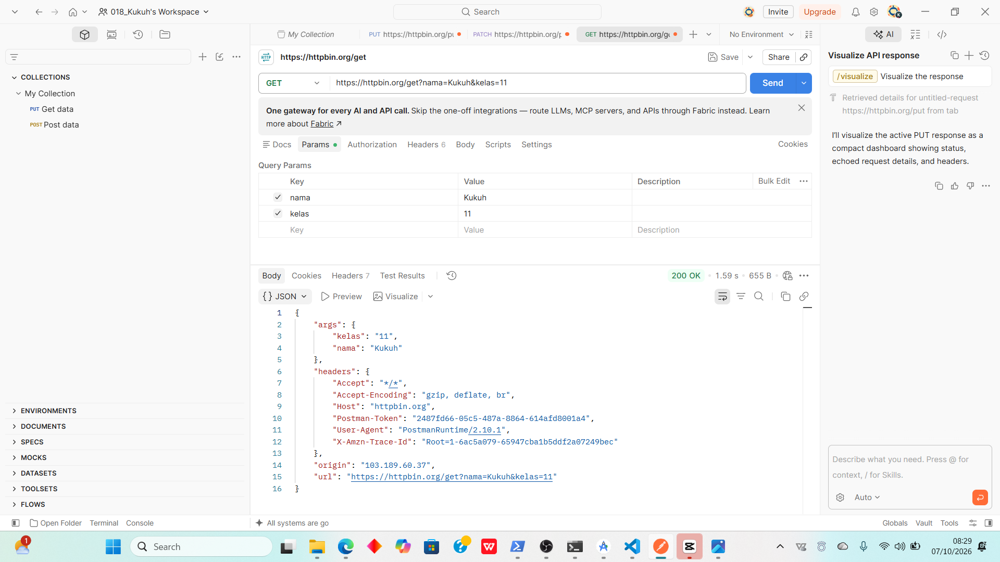
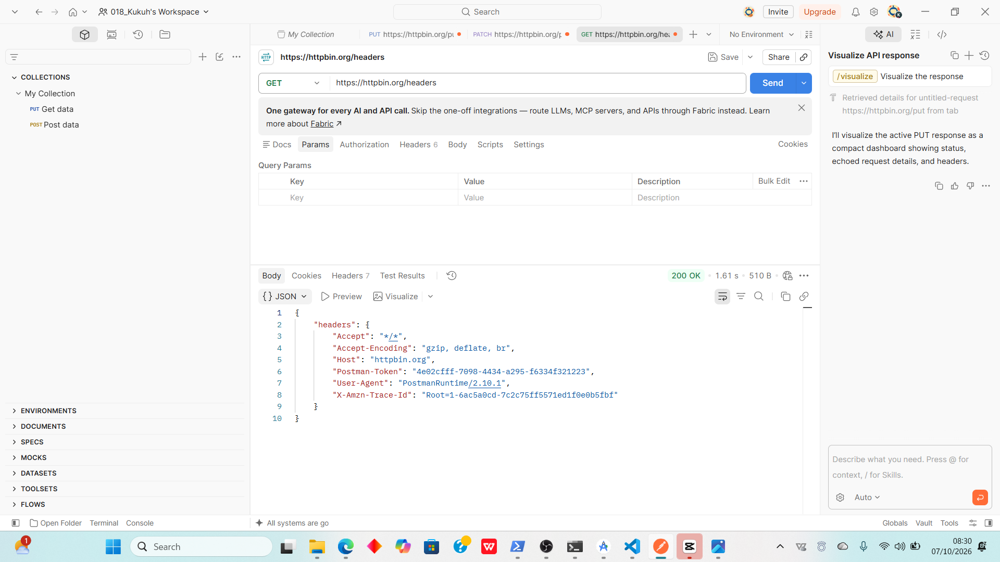

# Tugas Mandiri 3 — Memahami Request dan Response

## Pertanyaan Analisis

### 1. Apa yang dimaksud dengan permintaan (request), dan pihak mana yang mengirimkannya?
- **Pengertian:** Permintaan (*request*) adalah pesan atau data yang dikirimkan oleh klien ke server untuk meminta suatu aksi atau informasi tertentu.
- **Pihak pengirim:** Dikirimkan oleh pihak **klien** (seperti browser, aplikasi Postman, atau aplikasi mobile).

### 2. Apa yang dimaksud dengan respons (response), dan pihak mana yang mengirimkannya?
- **Pengertian:** Respons (*response*) adalah hasil balasan atau data yang dikembalikan oleh server kepada klien setelah memproses *request* yang diterima[cite: 14].
- **Pihak pengirim:** Dikirimkan oleh pihak **server**[cite: 14].

### 3. Apa fungsi query parameter? Jelaskan menggunakan parameter `nama` dan `kelas` pada pengujian Anda.
- **Fungsi:** Query parameter digunakan untuk mengirimkan tambahan data atau informasi pelengkap dari klien ke server melalui URL (biasanya diletakkan setelah tanda tanya `?`)[cite: 12].
- **Penjelasan Pengujian:** Ketika kita mengakses endpoint `https://httpbin.org/get?nama=Kukuh&kelas=11`, server akan menerima parameter `nama=Umar` dan `kelas=11` di dalam properti `args` pada objek JSON respons, yang membuktikan bahwa server berhasil membaca data tambahan yang dikirimkan melalui URL.

### 4. Apa fungsi HTTP header? Sebutkan satu header yang terlihat pada hasil pengujian dan jelaskan informasi yang dimuatnya.
- **Fungsi:** HTTP header berfungsi untuk membawa informasi tambahan atau meta-data penting mengenai *request* atau *response* (seperti jenis konten, informasi agen pengguna, atau token otorisasi)[cite: 13].
- **Contoh Header:** Header `User-Agent`[cite: 13]. Informasi yang dimuatnya adalah data mengenai jenis aplikasi, versi, dan sistem operasi yang digunakan oleh klien saat mengirimkan request ke server.

### 5. Apa perbedaan penempatan data pada query parameter di URL dan pada body permintaan?
- **Query Parameter (di URL):** Data diletakkan langsung di dalam URL, bersifat terbuka/bisa dilihat siapa saja di bilah alamat, dan biasanya digunakan untuk operasi pencarian atau filter data (`GET`)[cite: 13].
- **Body Permintaan (di Body):** Data disembunyikan di dalam badan/pesan request, lebih aman untuk mengirim data sensitif atau berukuran besar, dan biasanya digunakan pada method seperti `POST`, `PUT`, atau `PATCH`[cite: 13].

---

## Screenshot Pengujian Endpoint

### 1. Screenshot Pengujian Query Parameter (`/get?nama=Umar&kelas=11`)

### 2. Screenshot Pengujian Header (`/headers`)
